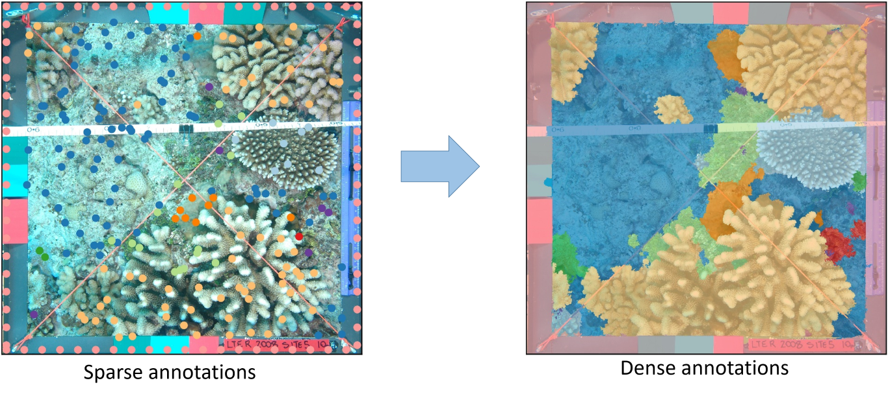

# Fast Multilevel Superpixel Segmentation (Fast-MSS)

Fast-MSS [1] is an improvement to [MSS](https://github.com/Shathe/ML-Superpixels), which was developed in [2] for the purpose of converting the existing sparse annotations for an image into dense annotations automatically. Fast-MSS is written entirely in Python and offers an easy-to-use API. 

The main advantages of Fast-MSS over MSS are:
1.	Instead of joining the labels made during each iteration, Fast-MSS calculates the mode of class labels across all iterations;
2.	For an over-segmentation algorithm, [Fast-SLIC](https://github.com/Algy/fast-slic) is used, which includes optimization techniques for use on a common CPU allowing it to perform 10x-33x faster than the conventional implementation [3]. 

The code can be used as easily as:
```python
labels = ['car', 'person', 'sidewalk', 'building', 'void'] # Must include all possible class labels

img = skimage.io.imread('MLC_image.png')
sparse = pandas.read_csv('Sparse_Annotations.csv') # format == columns['X', 'Y', 'Label']

mask = Fast_MSS(img, sparse, labels, start_iter = 7500, end_iter = 80, num_iter = 20, method = 'mode')

```
A more detailed example can be found in `Notebooks`

### Tips
* **Speed Boost:** Resizing the dimensions of images increases the speed of Fast-MSS without significantly affecting the accuracy of the resulting mask;
* Remember to always use nearest neighbor interpolation when resizing masks;
* The best values for the parameters `start_iter`, `end_iter`, and `num_iter` are a function of the resolution of the image and number of sparse annotations being used (try different values for different datasets);
* **Power Move:** To increase the number of sparse annotations associated with each image, consider training a patch-based image classifier on the existing annotations and then use *it* to add additional annotations for you;
* **Next Level:** With enough images/dense annotations, look into training a [deep learning semantic segmentation algorithm](https://github.com/qubvel/segmentation_models) [4] so you won't need to produce sparse annotations for images collected in the future. 



### References
1.  J. Pierce, Y. Rzhanov, K. Lowell, J. Dijkstra, “Reducing Annotation Times: Semantic Segmentation of Coral Reef Imagery”, 2020 IEEE Global Oceans.
2.  I. Alonso, M. Yuval, G. Eyal, T. Treibitz, and A. C. Murillo, Multilevel Superpixel Segmentation, GitHub repository, https://github.com/Shathe/ML-Superpixels
3.  K. Alchan, Fast-SLIC, (2019), GitHub repository, https://github.com/Algy/fast-slic
4.  P. Yakubovskiy, Segmentation Models, (2019), GitHub Repository, https://github.com/qubvel/segmentation_models
